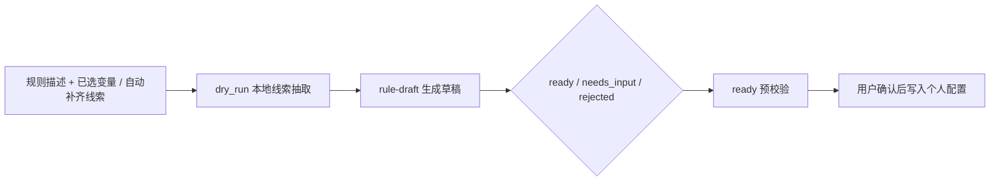

# Excel Check 架构设计

> 本文档是当前稳定 SDD，记录架构、核心契约、协议边界和已知限制。启动步骤、用户联调和前端子项目说明分别见 [../README.md](../README.md) 与 [../frontend/README.md](../frontend/README.md)。

## 1. 系统目标与边界

Excel Check 解决“同一批配置表需要被多个规则反复校验”的工程问题。核心设计是把数据源、变量和规则统一抽象成 `TaskTree`，所有执行入口共享同一个规则引擎和同一份结果协议。

两条业务线：

| 业务线 | 路由 | 持久化边界 | 说明 |
|---|---|---|---|
| 个人校验 | `/` | `project_id + user_id` | 临时编排、调试、个人规则草稿。 |
| 项目校验 | `/fixed-rules` | `project_id` | 长期复用的项目级规则配置。 |

明确不做：

- 不做 SaaS 化部署、容器编排、反代和 HTTPS。
- 不做飞书真实业务读取；当前仅保留占位入口。
- 不恢复 CSV 数据源；历史 CSV 配置只做提示兼容。
- 不让 AI 直接写入底层执行配置；AI 只生成意图草稿，后端确定性编译后再由用户确认保存。
- SVN 远端只承诺 `http(s)://` 单文件 `.xls/.xlsx`，不做 `svn://`、`svn+ssh://`、目录级数据源或分支切换。

## 2. 运行约束

| 层 | 约束 |
|---|---|
| 后端 | Python 3.10+、FastAPI、SQLAlchemy Async、SQLite 运行库、`/api/v1` 统一前缀。 |
| 前端 | Vue 3、TypeScript、Vite、Pinia、Element Plus、Tailwind v3。 |
| 数据读取 | 本地 Excel、浏览器上传 Excel、SVN Excel 复用同一元数据和执行链路。 |
| 部署 | 开发期前后端分离；共享部署时 FastAPI 托管 `frontend/dist`。 |
| 权限 | JWT 携带用户与当前项目；项目校验按项目隔离，个人校验按项目 + 用户隔离。 |

启动时会自动建表、创建默认项目和默认超级管理员。已有 `admin` 不会被每次启动强制重置密码；首次共享部署建议显式设置 `DEFAULT_SUPER_ADMIN_PASSWORD` 和 `JWT_SECRET_KEY`。

## 3. 核心数据模型

### 3.1 `TaskTree`

`TaskTree` 是个人校验与项目校验的统一执行入参：

```python
class DataSource:
    id: str
    type: Literal["local_excel", "feishu", "svn"]
    path: str | None
    url: str | None
    pathOrUrl: str | None
    token: str | None

class VariableTag:
    tag: str
    source_id: str
    sheet: str
    variable_kind: Literal["single", "composite"] = "single"
    column: str | None
    columns: list[str] | None
    key_column: str | None
    expected_type: Literal["int", "str", "json"] | None

class ValidationRule:
    rule_id: str | None
    rule_type: str
    params: dict[str, Any]

class TaskTree:
    sources: list[DataSource]
    variables: list[VariableTag]
    rules: list[ValidationRule]
```

执行入参模型默认 `extra="forbid"`；历史配置兼容字段只在对应迁移/读取层处理。

### 3.2 项目校验配置

项目校验当前配置版本为 `version = 6`，包含：

- `sources`: 数据源。
- `variables`: 单变量与组合变量。
- `groups`: 规则组。
- `rules`: 项目级规则。

旧版 `version 2/3/4/5` 在读取时自动迁移到 `version = 6`。`target_variable_tag` 在多组串行/映射规则里仍作为兼容字段保存，真实执行依赖节点配置。

### 3.3 统一执行结果

`POST /api/v1/engine/execute` 和 `POST /api/v1/fixed-rules/execute` 返回同一结构：

```python
{
    "code": 200,
    "msg": "Execution Completed",
    "meta": {
        "execution_time_ms": int,
        "total_rows_scanned": int,
        "failed_sources": [str],
    },
    "data": {
        "abnormal_results": [
            {
                "level": "error",
                "rule_name": str,
                "location": str,
                "row_index": int,
                "raw_value": Any,
                "display_value": Any,
                "message": str,
            }
        ]
    },
}
```

固定规则配置读取可额外返回 `meta.config_issues`，用于非阻断告警。

## 4. 规则能力

当前支持 10 类规则：

| 规则类型 | 说明 |
|---|---|
| `not_null` | 单字段非空。 |
| `unique` | 单字段唯一。 |
| `fixed_value_compare` | 单字段与固定值/规则集比较。 |
| `regex_check` | 正则完整匹配。 |
| `sequence_order_check` | 按原始行序校验连续性。 |
| `cross_table_mapping` | 单字段包含于引用变量。 |
| `composite_condition_check` | 组合变量筛选 + 分支断言。 |
| `dual_composite_compare` | 两组组合变量筛选、Key 对齐和字段比较。 |
| `multi_composite_pipeline_check` | 多组串行节点，失败短路。 |
| `multi_composite_mapping_check` | 多组映射节点，独立汇总异常。 |

规则引擎采用三层结构：

- `backend/app/rules/engine_core.py`：规则注册、调度和执行。
- `backend/app/rules/domain/`：值规范化、统一异常结果、operator 判断。
- `backend/app/rules/handlers/`：具体规则 handler，副作用 import 完成注册。

旧路径 `_*.py` 与 `rule_*.py` 仅作为 shim 保留兼容。

## 5. API 协议

所有业务 API 位于 `/api/v1` 下。

### 5.1 认证与管理

| 模块 | 入口 | 说明 |
|---|---|---|
| 认证 | `/auth/register`、`/auth/login`、`/auth/me`、`/auth/change-password`、`/auth/switch-project/{project_id}` | 登录、注册、当前用户、修改密码、切换项目。 |
| 管理后台 | `/admin/projects*`、`/admin/projects/{id}/members*`、`/admin/users/{id}/reset-password` | 项目、成员、角色和密码管理。 |

### 5.2 数据源与个人校验

| 方法 | 路径 | 说明 |
|---|---|---|
| `GET` | `/sources/capabilities` | 当前数据源能力声明。 |
| `POST` | `/sources/upload` | 浏览器上传 `.xlsx/.xls`。 |
| `POST` | `/sources/local-pick` | 服务所在机器文件选择。 |
| `POST` | `/sources/metadata` | Sheet/列元数据。 |
| `POST` | `/sources/column-preview` | 列预览。 |
| `POST` | `/sources/composite-preview` | 组合变量预览。 |
| `POST` | `/sources/svn-list`、`/sources/svn-refresh` | SVN 目录浏览与缓存刷新。 |
| `GET/PUT` | `/workbench/config` | 个人校验配置。 |
| `POST` | `/workbench/svn-update` | 刷新个人配置里的 SVN 来源。 |
| `POST` | `/engine/execute` | 统一执行入口。 |

SVN 鉴权失败使用 HTTP 403，不触发前端登录态过期逻辑；HTTP 401 仅表示真正未认证或登录态失效。

### 5.3 AI 规则助手

AI 规则助手只作用于个人校验 `/` 步骤 03。



| 能力 | 契约 |
|---|---|
| 输入 | 默认基于 `selected_variable_tags` 生成规则；开启 `allow_auto_complete=true` 后可返回待新增数据源/变量草稿。 |
| dry-run | `POST /ai/agents/rule-prompt-optimize?dry_run=true` 只做本地线索抽取，不读取 AI 凭据、不调用模型、不写草稿历史、不进入 AI 调用速率桶。 |
| 草稿 | `POST /ai/agents/rule-draft` 返回 `RuleDraftResponse`，保持 `RuleIntent / MissingItem / RuleDraftPayload` 字段兼容。 |
| 三态 | `ready` 可预校验，`needs_input` 说明缺口，`rejected` 说明当前规则库不支持能力。 |
| 编译 | 后端优先用 `workflow_hints`、字段解析、候选批判、compiler registry 和 materializer registry 确定性生成规则。 |
| 隐私 | 模型上下文只包含数据源 ID/类型、Sheet、列名、变量 schema、规则摘要，不发送业务单元格值。 |
| 历史 | 草稿历史按 `project_id + user_id` 隔离，最近 20 条。 |

AI 凭据按用户隔离并加密存储，GET 接口只返回脱敏信息。

### 5.4 项目校验

| 方法 | 路径 | 说明 |
|---|---|---|
| `GET/PUT` | `/fixed-rules/config` | 项目校验配置读写。 |
| `POST` | `/fixed-rules/import-preview` | 从个人规则导入前预检。 |
| `POST` | `/fixed-rules/import-from-workbench` | 确认导入个人规则。 |
| `POST` | `/fixed-rules/svn-update` | 刷新项目配置中的 SVN 来源。 |
| `POST` | `/fixed-rules/execute` | 项目校验执行。 |
| `GET` | `/fixed-rules/results/{result_id}` | 分页读取结果。 |
| `GET` | `/fixed-rules/results/{result_id}/export` | 导出 Excel。 |

## 6. 前端结构

| 路由 | 视图 | 说明 |
|---|---|---|
| `/` | `MainBoard.vue` | 个人校验四步工作流。 |
| `/fixed-rules` | `FixedRulesBoard.vue` | 项目校验。 |
| `/admin` | `AdminView.vue` | 管理后台。 |
| `/profile` | `ProfileView.vue` | 账号与 AI 配置。 |
| `/login` `/register` | `LoginView.vue` `RegisterView.vue` | 认证入口。 |

前端细节见 [MODULES.md](MODULES.md) 与 [../frontend/README.md](../frontend/README.md)。

## 7. 多用户与安全

- JWT 中携带当前用户与当前项目。
- 超级管理员可管理全部项目；项目管理员只能管理授权项目和受限默认项目视图。
- 个人校验配置按 `project_id + user_id` 隔离。
- 项目校验配置按 `project_id` 隔离。
- SVN 凭据按当前用户与 host 隔离，使用 Fernet 加密落盘。
- SVN URL 受 `SVN_URL_ALLOWLIST` 限制，降低 SSRF 风险。

## 8. 已知限制

| 限制 | 状态 |
|---|---|
| 飞书数据源 | 占位，未闭环。 |
| CSV 数据源 | 已下线，仅保留历史提示。 |
| 多配置集切换 | 未开放。 |
| SVN 远端 | 仅支持白名单 host、`http(s)://`、单文件 `.xls/.xlsx`。 |
| SVN 缓存清理 | `<runtime>/svn-cache/` 暂无定时清理策略。 |
| AI 能力 | 只覆盖当前 10 类规则；聚合、公式、平均值等复杂规则会返回 `rejected`。 |
