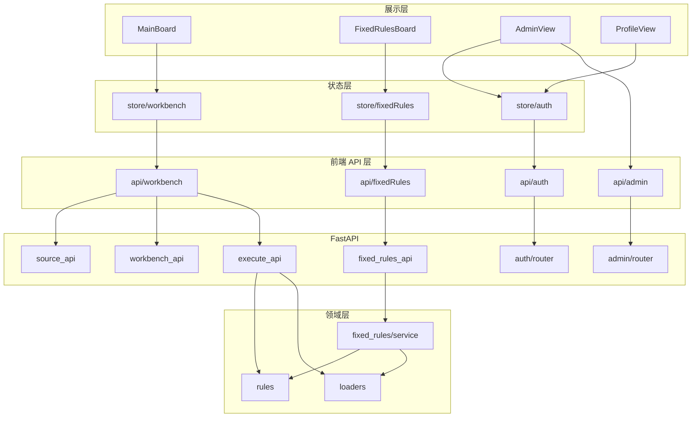

# Excel Check 模块速查

依据 [../README.md](../README.md)、[ARCHITECTURE.md](ARCHITECTURE.md) 与后端路由 [../backend/app/api/router.py](../backend/app/api/router.py)。

## 一、产品级入口（4 个路由）

| 入口 | 视图 | 作用 |
|:---|:---|:---|
| `/` | [MainBoard.vue](../frontend/src/views/MainBoard.vue) | 个人校验四步工作流（数据源 → 变量池 → 规则 → 结果），构建 `TaskTree` 走 `POST /api/v1/engine/execute`。 |
| `/fixed-rules` | [FixedRulesBoard.vue](../frontend/src/views/FixedRulesBoard.vue) | 项目校验：独立 `version=4` 配置（`sources / variables / groups / rules`），支持 SVN 更新与 `POST /api/v1/fixed-rules/execute`。 |
| `/admin` | [AdminView.vue](../frontend/src/views/AdminView.vue) | 项目 CRUD、成员角色与归属调整、密码重置；超级管理员可见全量项目并可在成员表本人行自调自己的归属项目，保存后前端会自动切到新的当前项目；项目管理员可见自己可管理的项目，并额外看到默认项目；默认项目内删成员仍只允许超级管理员，其他成员不能调整超管归属。 |
| `/profile` | [ProfileView.vue](../frontend/src/views/ProfileView.vue) | 账号信息、修改密码、切换归属项目。 |
| `/login` `/register` | [LoginView.vue](../frontend/src/views/LoginView.vue)、[RegisterView.vue](../frontend/src/views/RegisterView.vue) | 认证入口；默认管理员 `admin / 123456`。 |

## 二、前端目录（`frontend/src`）

### 2.1 共享展示组件 `components/shell/`

| 组件 | 作用 |
|:---|:---|
| [PageHeader.vue](../frontend/src/components/shell/PageHeader.vue) | 顶栏：面包屑 + h1 标题 + 右侧 actions 槽。 |
| [SectionHeader.vue](../frontend/src/components/shell/SectionHeader.vue) | 模块头：默认极简标题 + 描述；`variant="workbench"` 时切到「序号方块 + 标题 + 状态胶囊 + 副说明」个人校验样式。 |
| [StatPill.vue](../frontend/src/components/shell/StatPill.vue) | KPI 卡：caption + 等宽大数字 + StatusDot。 |
| [StatusDot.vue](../frontend/src/components/shell/StatusDot.vue) | 5 色状态胶囊：`pending / active / done / warn / error`。 |
| [EmptyState.vue](../frontend/src/components/shell/EmptyState.vue) | 空态：圆底 icon + 标题 + 副文案 + 可选 CTA。 |
| [DataTable.vue](../frontend/src/components/shell/DataTable.vue) | 数据表壳：极简表头 + 行 hover；空态调用方自填。 |

### 2.2 个人校验业务组件 `components/workbench/`

| 组件 | 作用 |
|:---|:---|
| [DataSourcePanel.vue](../frontend/src/components/workbench/DataSourcePanel.vue) | 步骤 1：数据源 CRUD、本地文件选择、`source_id`-级 `config_issues` 注入。 |
| [VariablePoolPanel.vue](../frontend/src/components/workbench/VariablePoolPanel.vue) | 步骤 2：单变量 / 组合变量、Sheet/列下拉、详情弹窗、JSON 预览。 |
| [WorkbenchRuleOrchestrationPanel.vue](../frontend/src/components/workbench/WorkbenchRuleOrchestrationPanel.vue) | 步骤 3：规则组导航 + 当前组规则 CRUD + 规则弹窗（单变量支持 `fixed_value_compare / not_null / unique / 包含(in)`，其中 `in` 保存时复用 `cross_table_mapping`；组合变量支持 `composite_condition_check`）。 |
| [ResultBoardPanel.vue](../frontend/src/components/workbench/ResultBoardPanel.vue) | 步骤 4：4 个统计块 + 异常明细表，支持 `extra` 槽（固定规则页注入 SVN 输出）。 |

### 2.3 已废弃 / 未使用组件

以下组件留在仓库中但当前未被任何视图引用，待统一清理：

- [components/workbench/WorkbenchSectionHeader.vue](../frontend/src/components/workbench/WorkbenchSectionHeader.vue)：薄包装到 `shell/SectionHeader.vue variant="workbench"`，新代码统一直用后者。
- [components/workbench/SectionBlock.vue](../frontend/src/components/workbench/SectionBlock.vue)、[components/workbench/WorkbenchStepCard.vue](../frontend/src/components/workbench/WorkbenchStepCard.vue)：早期个人校验折叠卡，已被全展开模块结构取代。
- [components/fixed-rules/FixedRulesResultPanel.vue](../frontend/src/components/fixed-rules/FixedRulesResultPanel.vue)：原项目校验结果区，已被 `ResultBoardPanel.vue` 复用替代。

### 2.4 状态、路由、API、工具

| 路径 | 作用 |
|:---|:---|
| [store/auth.ts](../frontend/src/store/auth.ts) | Pinia：JWT、用户、当前项目、可访问项目。 |
| [store/workbench.ts](../frontend/src/store/workbench.ts) | Pinia：个人校验数据源、变量、规则编排、执行结果。 |
| [store/fixedRules.ts](../frontend/src/store/fixedRules.ts) | Pinia：项目校验页独立状态，与个人校验隔离。 |
| [api/auth.ts](../frontend/src/api/auth.ts) | 注册 / 登录 / `me` / 切换项目 / 修改密码。 |
| [api/admin.ts](../frontend/src/api/admin.ts) | 项目 CRUD、成员管理、密码重置。 |
| [api/workbench.ts](../frontend/src/api/workbench.ts) | 数据源能力 / 元数据 / 列预览 / 引擎执行 / 个人校验配置持久化。 |
| [api/fixedRules.ts](../frontend/src/api/fixedRules.ts) | 项目校验配置 CRUD / SVN 更新 / 执行。 |
| [utils/apiFetch.ts](../frontend/src/utils/apiFetch.ts) | 统一注入 JWT、`401` 跳登录、空响应体兼容。 |
| [utils/taskTree.ts](../frontend/src/utils/taskTree.ts) | `TaskTree` 组装与归一化。 |
| [utils/ruleOrchestrationModel.ts](../frontend/src/utils/ruleOrchestrationModel.ts) | 个人校验 / 项目校验共享的规则模型工具。 |
| [utils/workbenchOrchestrationRules.ts](../frontend/src/utils/workbenchOrchestrationRules.ts) | 编排规则映射为引擎 `ValidationRule[]`。 |
| [utils/workbenchMeta.ts](../frontend/src/utils/workbenchMeta.ts) | 个人校验元数据辅助（来源类型、规则类型、列预览限制等）。 |
| [router/index.ts](../frontend/src/router/index.ts) | vue-router：路由表与全局认证守卫。 |
| [App.vue](../frontend/src/App.vue) | 应用壳：左固定边栏 + 右独立滚动工作区；项目卡 + 用户菜单。 |
| [style.css](../frontend/src/style.css) | 全局 token、Element Plus 校准、共享 utility class（`ec-btn-*` / `workbench-*` / `table-actions` 等）。 |

## 三、后端目录（`backend`）

### 3.1 启动与配置

| 文件 | 作用 |
|:---|:---|
| [run.py](../backend/run.py) | 启动 FastAPI（`uvicorn`）。 |
| [config.py](../backend/config.py) | 应用配置：`api_v1_prefix=/api/v1`、`SVN_EXECUTABLE` 等。 |
| [app/database.py](../backend/app/database.py) | 异步 SQLAlchemy 引擎、会话、`init_db()` 与默认管理员/项目兜底。 |

### 3.2 认证与权限

| 模块 | 作用 |
|:---|:---|
| [app/auth/router.py](../backend/app/auth/router.py) | `/api/v1/auth/*`：注册 / 登录 / me / change-password / switch-project；默认管理员登录失败时受控自修复。 |
| [app/auth/security.py](../backend/app/auth/security.py) | bcrypt 哈希、JWT 编解码。 |
| [app/auth/dependencies.py](../backend/app/auth/dependencies.py) | 当前用户、当前项目、超级管理员校验依赖。 |
| [app/admin/router.py](../backend/app/admin/router.py) | `/api/v1/admin/*`：项目 CRUD、成员角色 / 归属调整、密码重置；项目管理员获得受限版后台。 |

### 3.3 数据源与执行

| 模块 | 作用 |
|:---|:---|
| [app/api/source_api.py](../backend/app/api/source_api.py) | `/api/v1/sources/*`：能力声明、`local-pick`（tkinter）、metadata、列预览、组合预览。 |
| [app/api/workbench_api.py](../backend/app/api/workbench_api.py) | `/api/v1/workbench/config`：个人校验配置按 `project_id + user_id` 隔离持久化。 |
| [app/api/execute_api.py](../backend/app/api/execute_api.py) | `/api/v1/engine/execute`：消费 `TaskTree`，调用规则引擎，返回统一结果。 |
| [app/api/fixed_rules_api.py](../backend/app/api/fixed_rules_api.py) | `/api/v1/fixed-rules/*`：配置 CRUD、SVN 更新、执行。 |
| [app/api/schemas.py](../backend/app/api/schemas.py)、[app/api/fixed_rules_schemas.py](../backend/app/api/fixed_rules_schemas.py) | Pydantic 入参 / 出参模型。 |

### 3.4 项目校验服务

| 模块 | 作用 |
|:---|:---|
| [app/fixed_rules/service.py](../backend/app/fixed_rules/service.py) | 配置读写、`version 2/3 → 4` 自动迁移、`config_issues` 非阻断加载、临时 `TaskTree` 聚合并复用主引擎。 |
| [app/fixed_rules/schemas.py](../backend/app/fixed_rules/schemas.py) | 项目校验域内数据结构。 |

### 3.5 数据加载

| 模块 | 作用 |
|:---|:---|
| [app/loaders/local_reader.py](../backend/app/loaders/local_reader.py) | 本地 Excel（openpyxl/xlrd）/ CSV 读取、Sheet/列元数据、列预览。 |
| [app/loaders/svn_manager.py](../backend/app/loaders/svn_manager.py) | SVN CLI 调用与工作副本更新（含 Windows TortoiseSVN 自动探测）。 |
| [app/loaders/feishu_reader.py](../backend/app/loaders/feishu_reader.py) | 飞书读取占位实现（未闭环）。 |

### 3.6 规则引擎（三层架构）

| 模块 | 作用 |
|:---|:---|
| [app/rules/engine_core.py](../backend/app/rules/engine_core.py) | `RuleSpec` 注册中心、调度、执行；`register_rule(rule_type, *, dependent_tags=...)` 唯一签名。 |
| [app/rules/domain/](../backend/app/rules/domain/) | 值规范化（`value.py`）、统一异常结果（`result.py`）、operator 判定（`operators.py`）。 |
| [app/rules/infrastructure/](../backend/app/rules/infrastructure/) | 依赖 tag 提取器（`tag_extractor.py`）。 |
| [app/rules/handlers/](../backend/app/rules/handlers/) | 5 个 `rule_type` handler：`basics.py`、`cross.py`、`fixed.py`；`__init__.py` 副作用 import 触发 `@register_rule` 注册。 |

`backend/app/rules/_*.py` 与 `rule_*.py` 是旧路径薄壳 shim，仅 `from <new path> import *` 转发，对外行为零变更。

### 3.7 工具与测试

| 模块 | 作用 |
|:---|:---|
| [app/utils/formatter.py](../backend/app/utils/formatter.py) | 统一执行响应格式化。 |
| [app/utils/data_cleaner.py](../backend/app/utils/data_cleaner.py) | 数据清洗辅助。 |
| [tests/](../backend/tests/) | 接口与引擎黑盒回归；`tests/snapshots/engine/S1–S4.json` 是引擎执行的字节级快照基线。 |

## 四、关系简图（逻辑分层）

## 五、文档入口

| 文档 | 作用 |
|:---|:---|
| [../README.md](../README.md) | 项目简介、快速开始、API 速览。 |
| [ARCHITECTURE.md](ARCHITECTURE.md) | 当前稳定 SDD（数据模型 / 协议 / 架构 / 边界）。 |
| [MODULES.md](MODULES.md) | 本文档：模块速查。 |
| [../CHANGELOG.md](../CHANGELOG.md) | 版本日志。 |
| [archive/](archive/) | 历史快照（`PROJECT_RECORD.md` 与早期 `需求文档.md`），不再追加。 |
