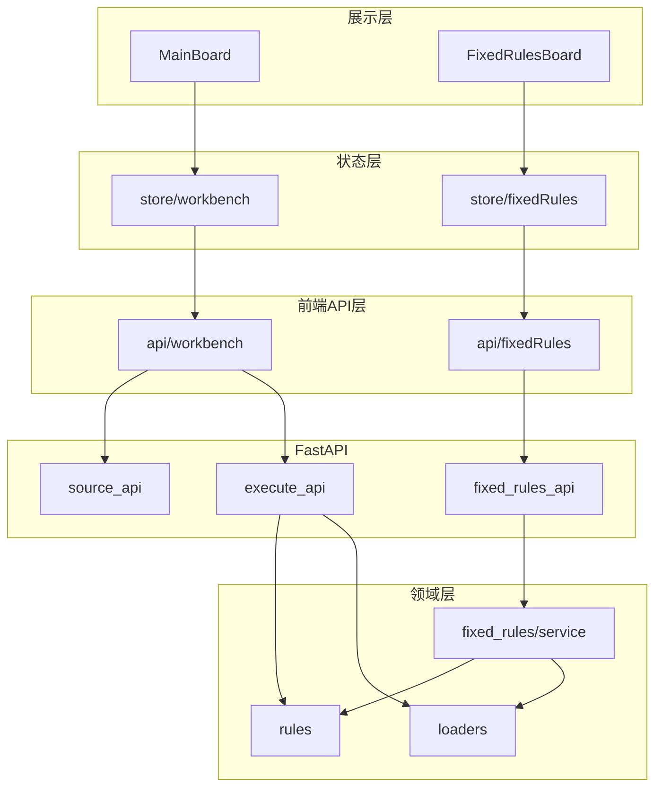

# Excel Check 项目模块作用一览

依据 [README.md](../README.md)、[需求文档.md](archive/需求文档.md) 第 2 章架构与目录、[frontend/README.md](../frontend/README.md) 及后端路由 [backend/app/api/router.py](../backend/app/api/router.py)。

---

## 一、产品级入口（两条业务线）

| 入口 | 作用 |
|:---|:---|
| 主工作台 `/`（[frontend/src/views/MainBoard.vue](../frontend/src/views/MainBoard.vue)） | 临时编排：数据源 → 变量池 → **静态**规则 → 执行结果；构建 `TaskTree` 并调用 `POST /api/v1/engine/execute`。 |
| 固定规则页 `/fixed-rules`（[frontend/src/views/FixedRulesBoard.vue](../frontend/src/views/FixedRulesBoard.vue)） | 长期复用：本页独立的 `sources / variables / groups / rules`，持久化到 `backend/.runtime/fixed-rules/default.json`（`version = 4`）；支持 SVN 更新与 `POST /api/v1/fixed-rules/execute`。 |

---

## 二、前端目录与模块（`frontend/src`）

| 路径/文件 | 作用 |
|:---|:---|
| [frontend/src/api/workbench.ts](../frontend/src/api/workbench.ts) | 封装主工作台相关 HTTP：数据源能力、元数据、列预览、引擎执行等。 |
| [frontend/src/api/fixedRules.ts](../frontend/src/api/fixedRules.ts) | 封装固定规则 API：读/写配置、SVN、执行。 |
| [frontend/src/store/workbench.ts](../frontend/src/store/workbench.ts) | Pinia：主工作台数据源、变量、规则、结果、缓存等状态。 |
| [frontend/src/store/fixedRules.ts](../frontend/src/store/fixedRules.ts) | Pinia：固定规则页独立状态，与主工作台隔离。 |
| [frontend/src/types/workbench.ts](../frontend/src/types/workbench.ts)、[frontend/src/types/fixedRules.ts](../frontend/src/types/fixedRules.ts) | TypeScript 类型定义。 |
| [frontend/src/utils/taskTree.ts](../frontend/src/utils/taskTree.ts) | `TaskTree` 组装/校验等工具逻辑。 |
| [frontend/src/utils/workbenchMeta.ts](../frontend/src/utils/workbenchMeta.ts) | 工作台元数据相关辅助。 |
| [frontend/src/router/index.ts](../frontend/src/router/index.ts) | 路由：`/`、`/fixed-rules`。 |
| [frontend/src/App.vue](../frontend/src/App.vue) | 应用壳：统一头部与导航切换两条入口。 |

### 工作台 UI 组件（`frontend/src/components/workbench`）

| 组件 | 作用 |
|:---|:---|
| [DataSourcePanel.vue](../frontend/src/components/workbench/DataSourcePanel.vue) | 步骤 1：数据源增删改、本地路径、调用 `local-pick` 等（固定规则页复用时可注入 `config_issues` 等提示）。 |
| [VariablePoolPanel.vue](../frontend/src/components/workbench/VariablePoolPanel.vue) | 步骤 2：单变量/组合变量、Sheet/列下拉、详情弹窗、JSON 预览等。 |
| [WorkbenchRuleOrchestrationPanel.vue](../frontend/src/components/workbench/WorkbenchRuleOrchestrationPanel.vue) | 步骤 3：规则组导航与当前组规则列表（与 `/fixed-rules` 同构的编排能力），数据仅存于 `workbench` store，映射为引擎规则后执行。 |
| [ResultBoardPanel.vue](../frontend/src/components/workbench/ResultBoardPanel.vue) | 步骤 4：统一结果看板（概览 + 异常列表）。 |
| [SectionBlock.vue](../frontend/src/components/workbench/SectionBlock.vue) | 步骤区块布局/标题等复用容器。 |

### 固定规则 UI（`frontend/src/components/fixed-rules`）

| 组件 | 作用 |
|:---|:---|
| [FixedRulesResultPanel.vue](../frontend/src/components/fixed-rules/FixedRulesResultPanel.vue) | 固定规则执行与 SVN 反馈的结果展示区。 |

---

## 三、后端目录与模块（`backend`）

### 启动与配置

| 文件 | 作用 |
|:---|:---|
| [backend/run.py](../backend/run.py) | 启动 FastAPI 应用。 |
| [backend/config.py](../backend/config.py) | 应用配置（含 `SVN_EXECUTABLE` 等）。 |

### API 层（`backend/app/api`）

| 模块 | 作用 |
|:---|:---|
| [router.py](../backend/app/api/router.py) | 聚合 `source` / `execute` / `fixed-rules` 子路由。 |
| [source_api.py](../backend/app/api/source_api.py) | 数据源：`capabilities`、`local-pick`（tkinter）、`metadata`、`column-preview`、组合预览等。 |
| [execute_api.py](../backend/app/api/execute_api.py) | 主引擎：`POST /api/v1/engine/execute`，消费 `TaskTree`。 |
| [fixed_rules_api.py](../backend/app/api/fixed_rules_api.py) | 固定规则：配置 CRUD、SVN、执行。 |
| [schemas.py](../backend/app/api/schemas.py)、[fixed_rules_schemas.py](../backend/app/api/fixed_rules_schemas.py) | Pydantic 请求/响应模型。 |

### 固定规则服务（`backend/app/fixed_rules`）

| 模块 | 作用 |
|:---|:---|
| [service.py](../backend/app/fixed_rules/service.py) | 配置读写、版本迁移、`config_issues` 非阻断加载、编排执行并对接统一结果协议。 |
| [schemas.py](../backend/app/fixed_rules/schemas.py) | 固定规则域内数据结构。 |

### 数据加载与外部能力（`backend/app/loaders`）

| 模块 | 作用 |
|:---|:---|
| [local_reader.py](../backend/app/loaders/local_reader.py) | 本地 Excel（openpyxl/xlrd）/ CSV 读取与元数据、预览数据。 |
| [svn_manager.py](../backend/app/loaders/svn_manager.py) | 固定规则场景下的 SVN CLI 调用与工作副本更新（含 Windows 探测逻辑）。 |
| [feishu_reader.py](../backend/app/loaders/feishu_reader.py) | 飞书读取占位（文档与代码均标明未完全打通）。 |

### 规则引擎（`backend/app/rules`）

| 模块 | 作用 |
|:---|:---|
| [engine_core.py](../backend/app/rules/engine_core.py) | 规则注册、调度执行、与主工作台执行链路核心。 |
| [rule_basics.py](../backend/app/rules/rule_basics.py) | 基础规则：`not_null`、`unique` 等。 |
| [rule_cross.py](../backend/app/rules/rule_cross.py) | 跨表类规则：`cross_table_mapping`。 |
| [rule_fixed.py](../backend/app/rules/rule_fixed.py) | 固定规则执行侧：`fixed_value_compare`、`not_null`、`unique`、组合变量 `composite_condition_check` 等。 |

### 工具（`backend/app/utils`）

| 模块 | 作用 |
|:---|:---|
| [formatter.py](../backend/app/utils/formatter.py) | 响应/结果格式化。 |
| [data_cleaner.py](../backend/app/utils/data_cleaner.py) | 数据清洗辅助。 |

### 测试（`backend/tests`）

| 作用 |
|:---|
| 对 execute、fixed-rules、SVN 等接口与逻辑的自动化回归（README 中记录 `pytest` 基线）。 |

---

## 四、文档类模块（仓库根与协作）

| 文档 | 作用 |
|:---|:---|
| [MODULES.md](MODULES.md) | 本文档：前后端与页面级模块职责一览与架构简图。 |
| [README.md](../README.md) | 项目简介、接口清单、联调步骤、变更说明汇总。 |
| [需求文档.md](archive/需求文档.md) | SDD：与代码对齐的架构、页面设计、协议与边界（已归档，由 `docs/ARCHITECTURE.md` 取代）。 |
| [frontend/README.md](../frontend/README.md) | 前端子项目说明与模块推进建议。 |
| [PROJECT_RECORD.md](archive/PROJECT_RECORD.md)、[CHANGELOG.md](../CHANGELOG.md) | 进度与版本记录（README「相关文档」引用）。 |

---

## 五、关系简图（逻辑分层）

---

**说明**：主工作台步骤 3 仅静态规则；主工作台静态规则仍主要面向**单变量**（组合变量进入 `TaskTree` 但步骤 3 会过滤）。固定规则页在 `version = 4` 下可绑定单变量与组合变量规则（含 `composite_condition_check`），与主工作台数据源/变量池持久化隔离。以上与 [需求文档.md](archive/需求文档.md) 第 1.3 节「能力边界」及 [README.md](../README.md)「当前关键能力」一致。
