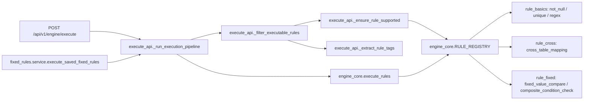

# 引擎与规则重构对齐基线（PR-1 / PR-2 / PR-3 共用）

> 本文档只盘点当前仓库实现的现状契约与影响面，不包含任何修改建议或改造代码片段。
> 所有源码引用均使用三段式 `startLine:endLine:filepath`，便于直接跳转复核。

## 1. 黑盒硬契约盘点

### 1.1 HTTP 接口字段（受锁定）

#### `POST /api/v1/engine/execute`

入参为 `TaskTree`，由 `pydantic` 严格校验（`extra="forbid"`），结构如下：

```46:54:backend/app/api/schemas.py
class TaskTree(BaseModel):
    """描述一次执行请求中包含的数据源、变量和规则集合。"""

    model_config = ConfigDict(extra="forbid")

    sources: list[DataSource] = Field(default_factory=list)
    variables: list[VariableTag] = Field(default_factory=list)
    rules: list[ValidationRule] = Field(default_factory=list)
```

出参由统一格式化函数构造：

```6:25:backend/app/utils/formatter.py
def build_execution_response(
    abnormal_results: list[dict[str, Any]] | None,
    execution_time_ms: int = 0,
    total_rows_scanned: int = 0,
    failed_sources: list[str] | None = None,
    msg: str = "Execution Completed",
) -> dict[str, Any]:
    """构建执行接口统一返回的响应结构。"""
    return {
        "code": 200,
        "msg": msg,
        "meta": {
            "execution_time_ms": execution_time_ms,
            "total_rows_scanned": total_rows_scanned,
            "failed_sources": failed_sources or [],
        },
        "data": {
            "abnormal_results": abnormal_results or [],
        },
    }
```

固定结构：

- `code`：固定 `200`
- `msg`：成功固定 `"Execution Completed"`
- `meta.execution_time_ms` / `meta.total_rows_scanned` / `meta.failed_sources`
- `data.abnormal_results`：异常结构体列表

异常路径统一返回 HTTP `400`，detail 文本即异常原因（见 1.4）：

```26:33:backend/app/api/execute_api.py
@router.post("/execute")
def execute_engine(task_tree: TaskTree) -> dict[str, Any]:
    """按 TaskTree 串起加载、规则执行与响应组装流程。"""
    start = time.perf_counter()

    try:
        execution_artifacts = _run_execution_pipeline(task_tree)
    except (ValueError, ImportError) as exc:
        raise HTTPException(status_code=400, detail=str(exc)) from exc
```

#### `/api/v1/fixed-rules/*`

继续走独立路由，但内部最终通过 `execute_saved_fixed_rules` → `execute_engine` 复用统一引擎：

```130:139:backend/app/fixed_rules/service.py
def execute_saved_fixed_rules(
    config: FixedRulesConfig | None = None,
) -> dict[str, object]:
    """执行固定规则。如果传入 config 则直接使用，否则从文件加载。"""
    if config is None:
        config = load_fixed_rules_config()
    if not config.rules:
        raise ValueError("当前没有可执行的固定规则，请先配置规则再执行。")
    return execute_engine(build_fixed_rules_task_tree(config))
```

固定规则配置 v4 结构同样受 `extra="forbid"` 锁定：

```117:128:backend/app/api/fixed_rules_schemas.py
class FixedRulesConfig(BaseModel):
    """描述固定规则页的完整持久化配置。"""

    model_config = ConfigDict(extra="forbid")

    version: int = 4
    configured: bool = False
    sources: list[DataSource] = Field(default_factory=list)
    variables: list[VariableTag] = Field(default_factory=list)
    groups: list[FixedRuleGroup] = Field(default_factory=list)
    rules: list[FixedRuleDefinition] = Field(default_factory=list)
```

### 1.2 TaskTree / ValidationRule.params 字段

#### `DataSource`

```8:19:backend/app/api/schemas.py
class DataSource(BaseModel):
    """描述单个数据源的基础配置。"""

    model_config = ConfigDict(extra="forbid")

    id: str
    type: Literal["local_excel", "local_csv", "feishu", "svn"]
    path: str | None = None
    url: str | None = None
    pathOrUrl: str | None = None
    token: str | None = None
```

`type` 枚举锁死 4 类，新增 source 类型必须改 schema。

#### `VariableTag`

```21:33:backend/app/api/schemas.py
class VariableTag(BaseModel):
    """描述变量标签与数据源字段之间的映射关系。"""

    model_config = ConfigDict(extra="forbid")

    tag: str
    source_id: str
    sheet: str
    variable_kind: Literal["single", "composite"] = "single"
    column: str | None = None
    columns: list[str] | None = None
    key_column: str | None = None
    expected_type: Literal["int", "str", "json"] | None = None
```

`variable_kind` 锁死为 `single` / `composite`，组合变量 JSON 映射键的内部字段名固定为 `__key__`：

```19:21:backend/app/rules/rule_fixed.py
COMPOSITE_KEY_FIELD = "__key__"
COMPARE_OPERATORS = {"eq", "ne", "gt", "lt"}
SET_STYLE_OPERATORS = {"unique", "duplicate_required"}
```

#### `ValidationRule`

```36:43:backend/app/api/schemas.py
class ValidationRule(BaseModel):
    """描述单条校验规则及其参数。"""

    model_config = ConfigDict(extra="forbid")

    rule_id: str | None = None
    rule_type: str
    params: dict[str, Any] = Field(default_factory=dict)
```

各 `rule_type` 的 `params` 硬约束：

- `not_null` / `unique`：`params.target_tags: list[str]`（非空、元素均为非空字符串）

```16:26:backend/app/rules/rule_basics.py
def _get_target_tags(rule: ValidationRule) -> list[str]:
    target_tags = rule.params.get("target_tags")
    if not isinstance(target_tags, list) or not target_tags:
        raise ValueError(
            f"Rule '{rule.rule_type}' requires non-empty params.target_tags."
        )
    if not all(isinstance(tag, str) and tag for tag in target_tags):
        raise ValueError(
            f"Rule '{rule.rule_type}' requires params.target_tags to be a string list."
        )
    return target_tags
```

- `cross_table_mapping`：`params.dict_tag` + `params.target_tag`（均为非空字符串）

```22:26:backend/app/rules/rule_cross.py
def _get_single_tag_param(rule: ValidationRule, param_name: str) -> str:
    tag = rule.params.get(param_name)
    if not isinstance(tag, str) or not tag:
        raise ValueError(f"Rule '{rule.rule_type}' requires params.{param_name}.")
    return tag
```

- `fixed_value_compare`：`params.target_tag` + `operator`(`eq/ne/gt/lt`) + `expected_value` + `rule_name` + `location`（前四个由 `_get_fixed_rule_param` 校验为非空字符串；`location` 由固定规则页 `_build_fixed_rule_params` 注入）

```459:476:backend/app/rules/rule_fixed.py
@register_rule("fixed_value_compare")
def check_fixed_value_compare(
    rule: ValidationRule,
    context: RuleExecutionContext,
) -> list[dict[str, Any]]:
    """执行固定规则模块的单列常量比较。"""
    target_tag = _get_fixed_rule_param(rule, "target_tag")
    operator = _get_fixed_rule_param(rule, "operator")
    expected_value = _get_fixed_rule_param(rule, "expected_value")
    rule_name = _get_fixed_rule_param(rule, "rule_name")

    variable, frame, column_name = _get_single_variable_frame(
        context,
        target_tag,
        rule.rule_type,
    )
    abnormal_results: list[dict[str, Any]] = []
    location = f"{variable.sheet} -> {column_name}"
```

- `composite_condition_check`：`params.target_tag` + `params.rule_name` + `params.composite_config`（结构由 `CompositeRuleConfig` 严格校验）

```543:558:backend/app/rules/rule_fixed.py
@register_rule("composite_condition_check")
def check_composite_condition_check(
    rule: ValidationRule,
    context: RuleExecutionContext,
) -> list[dict[str, Any]]:
    """执行组合变量条件分支校验。"""
    target_tag = _get_fixed_rule_param(rule, "target_tag")
    rule_name = _get_fixed_rule_param(rule, "rule_name")
    composite_config = _get_composite_rule_config(rule)
    variable, frame = _get_composite_variable_frame(context, target_tag, rule.rule_type)

    filtered_frame = _apply_composite_filters(
        frame,
        variable,
        composite_config.global_filters,
    )
    if filtered_frame.empty:
        return []
```

固定规则页向引擎投递的 `params` 注入逻辑（决定 `target_tag` / `rule_name` / `location` / `composite_config` 等键名与取值来源）：

```1196:1226:backend/app/fixed_rules/service.py
def _build_fixed_rule_params(
    rule: FixedRuleDefinition,
    target_variable: VariableTag,
) -> dict[str, object]:
    """???????????????? params?"""
    if rule.rule_type == "composite_condition_check":
        return {
            "target_tag": target_variable.tag,
            "rule_name": rule.rule_name,
            "composite_config": rule.composite_config.model_dump(mode="json", exclude_none=True)
            if rule.composite_config
            else None,
        }

    location = f"{target_variable.sheet} -> {target_variable.column}"

    if rule.rule_type == "fixed_value_compare":
        return {
            "target_tag": target_variable.tag,
            "operator": rule.operator,
            "expected_value": rule.expected_value,
            "rule_name": rule.rule_name,
            "location": location,
        }

    return {
        "target_tags": [target_variable.tag],
        "rule_name": rule.rule_name,
        "location": location,
    }
```

### 1.3 `abnormal_results` 字段集合

引擎层（基础规则）输出的 6 字段集合：

```69:89:backend/app/rules/rule_basics.py
def _build_abnormal_result(
    *,
    level: str,
    rule_name: str,
    tag: str,
    column_name: str,
    row_index: int,
    raw_value: Any,
    message: str,
    location: str | None = None,
) -> dict[str, Any]:
    if hasattr(raw_value, "item"):
        raw_value = raw_value.item()
    return {
        "level": level,
        "rule_name": rule_name,
        "location": location or f"{tag} -> {column_name}",
        "row_index": int(row_index),
        "raw_value": raw_value,
        "message": message,
    }
```

固定规则模块输出的同形 6 字段集合（结构对齐基础规则）：

```116:135:backend/app/rules/rule_fixed.py
def _build_fixed_rule_result(
    *,
    row_index: int,
    raw_value: Any,
    rule_name: str,
    location: str,
    message: str,
    level: str = "error",
) -> dict[str, Any]:
    """构建固定规则模块的统一异常结构。"""
    if hasattr(raw_value, "item"):
        raw_value = raw_value.item()
    return {
        "level": level,
        "rule_name": rule_name,
        "location": location,
        "row_index": int(row_index),
        "raw_value": raw_value,
        "message": message,
    }
```

abnormal_results 元素的字段集合 `{level, rule_name, location, row_index, raw_value, message}` 被 `test_execute_api.py` 整体集合相等锁住（见 1.4）。

### 1.4 测试硬锁定的 detail / 字段子串清单

下表为「字符串子串 / 字段集合」级断言，重构期间不能丢失：

| 锁定内容 | 文件 | 行号 |
|---|---|---|
| abnormal_results 字段集 `set(item) == {level, rule_name, location, row_index, raw_value, message}` | `backend/tests/test_execute_api.py` | L109-117 |
| `not_null` → `level == "error"` | `backend/tests/test_execute_api.py` | L97-99 |
| `unique` → `level == "warning"` | `backend/tests/test_execute_api.py` | L101-103 |
| `cross_table_mapping` → `level == "error"` | `backend/tests/test_execute_api.py` | L104-107 |
| `meta.failed_sources == []` / `meta.total_rows_scanned > 0` | `backend/tests/test_execute_api.py` | L91-92 |
| 400 detail 子串：`"Unsupported rule_type"` | `backend/tests/test_execute_api.py` | L149 |
| 400 detail 子串：`"params.target_tags"` | `backend/tests/test_execute_api.py` | L186 |
| 400 detail 子串：`"unknown source_id"` | `backend/tests/test_execute_api.py` | L218 |
| 元数据接口 detail 子串：`"变量池下拉提取第一版仅支持 Excel 数据源"` | `backend/tests/test_execute_api.py` | L323 |
| 失效路径 issue 包含 `source_id == "items-source"` 与解析后路径 | `backend/tests/test_fixed_rules_api.py` | L244-249 |
| save / execute 失败 detail 子串：`"items-source"` | `backend/tests/test_fixed_rules_api.py` | L305-306 |
| 未知变量绑定 detail 子串：`"missing-tag"` | `backend/tests/test_fixed_rules_api.py` | L441 |
| 组合变量绑单变量 detail 子串：`"rule-composite"` | `backend/tests/test_fixed_rules_api.py` | L482 |
| 组合规则非法 detail 子串：`"rule-composite-branch"` | `backend/tests/test_fixed_rules_api.py` | L536 / L565 / L594 / L624 / L654 |
| 比较类规则缺 expected_value detail 子串：`"expected_value"` | `backend/tests/test_fixed_rules_api.py` | L711 |
| not_null 异常 message 子串：`"不能为空"` 且 `level == "error"` 且 `location == "items -> INT_ID"` | `backend/tests/test_fixed_rules_api.py` | L769-772 |
| unique 异常 `level == "warning"` 且 `location == "items -> INT_ID"` | `backend/tests/test_fixed_rules_api.py` | L806-808 |
| 组合变量执行：`total_rows_scanned == 4`、唯一异常 `row_index == 5`、`location == "items -> INT_Group"`、`rule_name == "派系与分组映射校验"` | `backend/tests/test_fixed_rules_api.py` | L687-691 |
| SVN 缺失 CLI detail 子串：`"svn 命令"` | `backend/tests/test_fixed_rules_api.py` | L1031 |
| SVN 去重统计：`total_paths == 2`、`updated_paths == 2` | `backend/tests/test_fixed_rules_api.py` | L999-1003 |

---

## 2. 调用点全量清单

针对 `@register_rule(`、`RULE_REGISTRY`、`execute_rules(`、`_extract_rule_tags`、`_ensure_rule_supported` 五个关键符号，全仓 grep 命中如下：

| 文件 | 行号 | 用法说明 |
|---|---|---|
| `backend/app/rules/engine_core.py` | 26 | `RULE_REGISTRY: dict[str, RuleHandler] = {}` —— 全局注册表声明 |
| `backend/app/rules/engine_core.py` | 29-36 | `register_rule(rule_type)` 装饰器实现，写入 `RULE_REGISTRY[rule_type]` |
| `backend/app/rules/engine_core.py` | 39-57 | `execute_rules(task_tree, loaded_variables)` 按规则顺序查表执行；未注册 `rule_type` 抛 `ValueError("Unsupported rule_type: ...")` |
| `backend/app/rules/engine_core.py` | 60 | 末尾 `from backend.app.rules import rule_basics, rule_cross, rule_fixed` —— 触发 handler 注册副作用 |
| `backend/app/rules/rule_basics.py` | 108 | `@register_rule("not_null")` |
| `backend/app/rules/rule_basics.py` | 138 | `@register_rule("unique")` |
| `backend/app/rules/rule_basics.py` | 170 | `@register_rule("regex")` —— 占位实现，handler 直接 `return []` |
| `backend/app/rules/rule_cross.py` | 29 | `@register_rule("cross_table_mapping")` |
| `backend/app/rules/rule_fixed.py` | 459 | `@register_rule("fixed_value_compare")` |
| `backend/app/rules/rule_fixed.py` | 543 | `@register_rule("composite_condition_check")` |
| `backend/app/api/execute_api.py` | 17 | `from backend.app.rules.engine_core import RULE_REGISTRY, execute_rules` |
| `backend/app/api/execute_api.py` | 62-65 | `abnormal_results = execute_rules(executable_task_tree, load_result["loaded_variables"])` |
| `backend/app/api/execute_api.py` | 192 | `_ensure_rule_supported(rule)` 在 `_filter_executable_rules` 内调用 |
| `backend/app/api/execute_api.py` | 193 | `dependent_tags = _extract_rule_tags(rule)` 在 `_filter_executable_rules` 内调用 |
| `backend/app/api/execute_api.py` | 217-220 | `_ensure_rule_supported` 实现：`rule.rule_type not in RULE_REGISTRY` → `ValueError("Unsupported rule_type: ...")` |
| `backend/app/api/execute_api.py` | 223-252 | `_extract_rule_tags` 实现：分支覆盖 `not_null/unique` / `cross_table_mapping` / `fixed_value_compare`，其余 `rule_type` 落入 `return []` |

调用拓扑（仅供参考）：



---

## 3. rule_type 与 dependent_tags 当前覆盖矩阵

| rule_type | handler 文件 | 依赖 tag 提取行为 | 是否被 `execute_api._extract_rule_tags` 覆盖 |
|---|---|---|---|
| `not_null` | `backend/app/rules/rule_basics.py` L108-135 | handler 内 `_get_target_tags` 读 `params.target_tags`（list[str]） | 是 —— `execute_api.py` L225-235 显式提取 `target_tags` |
| `unique` | `backend/app/rules/rule_basics.py` L138-167 | 同 `not_null`，复用 `_get_target_tags` | 是 —— 与 `not_null` 同分支 |
| `regex` | `backend/app/rules/rule_basics.py` L170-175 | handler 直接 `return []`，不读取任何 tag | 否 —— 落入末尾 `return []`，但因 handler 也不依赖任何 tag，目前不会触发漏判（占位能力，本轮不动） |
| `cross_table_mapping` | `backend/app/rules/rule_cross.py` L29-68 | handler 内 `_get_single_tag_param` 读 `params.dict_tag` 与 `params.target_tag` | 是 —— `execute_api.py` L237-244 显式提取两个 tag |
| `fixed_value_compare` | `backend/app/rules/rule_fixed.py` L459-540 | handler 内 `_get_fixed_rule_param` 读 `params.target_tag`（单变量） | 是 —— `execute_api.py` L246-250 显式提取 `target_tag` |
| `composite_condition_check` | `backend/app/rules/rule_fixed.py` L543-579 | handler 内 `_get_fixed_rule_param` 读 `params.target_tag`（组合变量） | **否 —— 当前 `_extract_rule_tags` 没有该分支，会直接走到末尾 `return []`** |

### 重点：`composite_condition_check` 漏判说明

`_extract_rule_tags` 当前实现：

```223:252:backend/app/api/execute_api.py
def _extract_rule_tags(rule: ValidationRule) -> list[str]:
    """从规则参数中提取其依赖的变量标签。"""
    if rule.rule_type in {"not_null", "unique"}:
        target_tags = rule.params.get("target_tags")
        if not isinstance(target_tags, list) or not target_tags:
            raise ValueError(
                f"Rule '{rule.rule_type}' requires non-empty params.target_tags."
            )
        if not all(isinstance(tag, str) and tag for tag in target_tags):
            raise ValueError(
                f"Rule '{rule.rule_type}' requires params.target_tags to be a string list."
            )
        return target_tags

    if rule.rule_type == "cross_table_mapping":
        dict_tag = rule.params.get("dict_tag")
        target_tag = rule.params.get("target_tag")
        if not isinstance(dict_tag, str) or not dict_tag:
            raise ValueError("Rule 'cross_table_mapping' requires params.dict_tag.")
        if not isinstance(target_tag, str) or not target_tag:
            raise ValueError("Rule 'cross_table_mapping' requires params.target_tag.")
        return [dict_tag, target_tag]

    if rule.rule_type == "fixed_value_compare":
        target_tag = rule.params.get("target_tag")
        if not isinstance(target_tag, str) or not target_tag:
            raise ValueError("Rule 'fixed_value_compare' requires params.target_tag.")
        return [target_tag]

    return []
```

由此带来的当前实际行为：

- `composite_condition_check` 进入 `_filter_executable_rules` 时，`dependent_tags == []`
- `missing_tags` / `failed_sources` / `unresolved_tags` 三层校验全部跳过
- 当组合变量所在 source 加载失败并被记入 `failed_sources` 时，该规则**不会被跳过**，而是直接交给 handler；handler 在 `loaded_variables` 中找不到对应 tag，最终抛 `ValueError(... references unknown tag ...)`，被 `execute_engine` 转成 HTTP 400
- 也就是说：固定规则页正常路径（source 加载成功）目前看不到该问题；只有 source 加载失败时，错误码会从「source 级降级」变成「规则级 400」

测试侧目前**未对此分支单独锁断言**（`backend/tests/test_fixed_rules_api.py` 仅覆盖 source 加载成功后的组合规则正向链路 L658-692）。该问题应在 PR-1 baseline 快照阶段被显式补一条 case，避免后续重构期失忆。

---

## 4. Phase 1 / Phase 2 影响面

### 4.1 Phase 1 必改文件清单

| 文件 | 影响原因 |
|---|---|
| `backend/app/api/execute_api.py` | 唯一需要修改的业务文件：在 `_extract_rule_tags` 中补 `composite_condition_check` 的 `target_tag` 提取，使其与 handler 真实依赖一致；同时不破坏现有 `not_null` / `unique` / `cross_table_mapping` / `fixed_value_compare` 分支与 detail 子串 |

> Phase 1 不涉及任何 schema 变更、不动注册表实现、不动任何 handler 内部行为。

### 4.2 Phase 2 仅作物理移动的文件清单

| 文件 | 移动性质 |
|---|---|
| `backend/app/rules/rule_basics.py` | 仅按规则归属拆分到目录或重命名，handler 函数体与装饰器名称（`not_null` / `unique` / `regex`）不动 |
| `backend/app/rules/rule_cross.py` | 同上，`cross_table_mapping` handler 不动 |
| `backend/app/rules/rule_fixed.py` | 同上，`fixed_value_compare` / `composite_condition_check` handler 不动 |
| `backend/app/rules/engine_core.py` 末尾的副作用 import 行 | 物理路径变更后需要相应同步导入路径，行为不变 |

### 4.3 不改文件清单（含理由）

| 文件 | 不改理由 |
|---|---|
| `backend/app/api/schemas.py` | `TaskTree` / `DataSource` / `VariableTag` / `ValidationRule` 是黑盒硬契约入口，外部 v1 协议必须保持稳定 |
| `backend/app/api/fixed_rules_schemas.py` | v4 配置结构与 `composite_*` 模型直接被前端 `/fixed-rules` 与现有持久化 JSON 锁住 |
| `backend/app/utils/formatter.py` | `code/msg/meta/data` 字段集是统一结果协议，所有调用方都依赖该外形 |
| `backend/app/fixed_rules/service.py` 中 `build_fixed_rules_task_tree` 与 `_build_fixed_rule_params` | 决定固定规则页向引擎注入的 `params` 形状，与 handler 端的 `_get_fixed_rule_param` 一一对应；本轮不引入新参数 |
| `backend/app/api/fixed_rules_api.py` | 入口路由与 401/400 流程已被 `test_fixed_rules_api.py` 多处锁定 |
| `backend/tests/` 全量 | 红线明确禁止改动，测试是本轮唯一的稳定参照系 |

---

## 5. 占位能力声明

| 能力 | 当前实现位置 | 当前行为 | 本轮处置 |
|---|---|---|---|
| `regex` 规则 | `backend/app/rules/rule_basics.py` L170-175 | `@register_rule("regex")` 已注册，handler 实现仅 `return []`，即使被引用也不会产出异常结果 | **本轮不动**：保持注册表完整性，handler 内部空实现保留 |
| `feishu` 数据源 | `backend/app/api/execute_api.py` L165-167 | `read_feishu_sheet(...)` 后直接 `return {}`，不会把变量写入 `loaded_variables` | **本轮不动**：保留现有占位，固定规则模块未暴露此 source 类型 |
| `svn` 数据源（主工作台 source） | `backend/app/api/execute_api.py` L169-171 | 主工作台 source 链路已串通 `sync_svn_source` + `load_variables_by_source`；端到端真实闭环目前仅在固定规则模块的 `/api/v1/fixed-rules/svn-update` 中验证（`backend/app/fixed_rules/service.py` L141-185） | **本轮不动**：不扩展 source 行为，不调整 SVN CLI 探测策略 |

---

## 6. baseline 快照覆盖建议（PR-1 落地）

PR-1 引入快照测试时，建议至少覆盖以下 4 类 case，确保 PR-2 / PR-3 拆包/搬迁阶段任何回归都会被立即捕获：

### S1 —— 主工作台最小三规则链路（基线现状）

- 入参形态：1 个 `local_excel` source + 2 个 `single` 变量 + `not_null` / `unique` / `cross_table_mapping` 各 1 条
- 对齐参考：`backend/tests/test_execute_api.py` `test_execute_engine_returns_three_rule_results`（L37-117）
- 锁定要点：
  - `code == 200` / `msg == "Execution Completed"` / `meta.failed_sources == []`
  - 三类异常各自的 `level`（`error / warning / error`）
  - `abnormal_results` 元素字段集 `{level, rule_name, location, row_index, raw_value, message}`

### S2 —— 固定规则模块 3 类规则混合执行

- 入参形态：2 个 source + 3 个 single 变量 + `fixed_value_compare` / `not_null` / `unique` 各 1 条（跨 source）
- 对齐参考：`backend/tests/test_fixed_rules_api.py` `test_execute_fixed_rules_supports_mixed_rule_types_in_one_run`（L811-910）
- 锁定要点：
  - `meta.total_rows_scanned == 9`
  - 命中 `B 文件 DESC 不能为空` 与 `B 文件 INT_ID 必须唯一`，且 `A 文件 INT_ID > 0` 不命中
  - 每条异常的 `rule_name` / `location` 与 `_build_fixed_rule_params` 注入完全一致

### S3 —— 组合变量条件分支端到端

- 入参形态：1 个 source + 1 个 `composite` 变量（`INT_ID/INT_Faction/INT_Group`，key=`INT_ID`）+ `composite_condition_check` 1 条（含 1 个全局过滤 + 2 个分支）
- 对齐参考：`backend/tests/test_fixed_rules_api.py` `test_execute_fixed_rules_supports_composite_condition_check`（L657-692）与上方组合 fixture L62-132
- 锁定要点：
  - `total_rows_scanned == 4`、`abnormal_results` 长度 `== 1`
  - 唯一异常 `row_index == 5`、`location == "items -> INT_Group"`、`rule_name == "派系与分组映射校验"`
  - **额外建议**：补一条「组合变量所在 source 加载失败」case，固化 `_extract_rule_tags` 漏判修复前后的行为差异（用于在 PR-1 阶段把 §3 重点风险点显式快照）

### S4 —— 失败降级 + 错误码

- 拆 3 条子 case，各自锁定 400 detail 子串：
  - 未注册 `rule_type` → `"Unsupported rule_type"`（对齐 `test_execute_api.py` L121-149）
  - `params.target_tags` 类型错误 → `"params.target_tags"`（对齐 `test_execute_api.py` L152-186）
  - 变量引用不存在 source → `"unknown source_id"`（对齐 `test_execute_api.py` L189-218）
- 推荐补一条「source 加载失败但其余 source 正常」case，验证 `meta.failed_sources` 仅记录失败项、其余规则继续执行

---

## 总结

本次盘点结果与 v2 重构方案完全一致：影响面仍只落在 `backend/app/api/execute_api.py` 一个业务文件（Phase 1），规则文件物理移动（Phase 2）不破坏外部契约；唯一新发现是 `_extract_rule_tags` 当前对 `composite_condition_check` 漏判，应在 PR-1 baseline S3 中显式补一条 source 失败 case 加以锁定。
